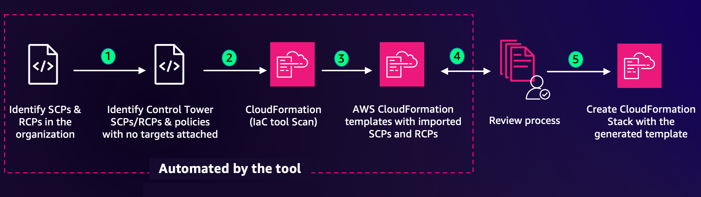

## Existing AWS SCPs and RCPs import tool

A sample command line tool to import existing SCPs and RCPs into AWS CloudFormation templates using CloudFormation infrastructure as code generator (IaC generator). This allows you to to automate the management of your SCPs and RCPs at scale. The following figure provides the end-to-end flow:

## Considerations before implementing the solution

1. If you have enabled the [AWS Organizations policy management delegation](https://docs.aws.amazon.com/organizations/latest/userguide/orgs_delegate_policies.html), you should run this solution from the delegated administrator account. Otherwise, you can run the solution using the management account.
    **Note:** [Delegating management of organizations policies](https://docs.aws.amazon.com/organizations/latest/userguide/orgs_delegate_policies.html) to a delegated administrator member account is recommended best practice.

2. AWS Control Tower SCPs and RCPs (with or without targets) won’t be imported to the CloudFormation templates because they should be managed using AWS Control Tower.  [Changes made to Control Tower resources](https://docs.aws.amazon.com/controltower/latest/userguide/walkthrough-delete.html) outside of Control Tower can cause drift and affect AWS Control Tower functionality in unpredictable ways.

3. [FullAWSAccess](https://console.aws.amazon.com/organizations/?#/policies/p-FullAWSAccess) SCP and [RCPFullAWSAccess](https://677276094262-lagb2dh4.us-east-1.console.aws.amazon.com/organizations/v2/home/policies/resource-control-policy/p-RCPFullAWSAccess) RCP are [AWS managed policies](https://docs.aws.amazon.com/organizations/latest/userguide/orgs_reference_available-policies.html) that won’t be imported to CloudFormation because CloudFormation stacks do not allow importing AWS managed resources.

4. You might see multiple CloudFormation templates created if you exceed the [CloudFormation template size quotas](https://docs.aws.amazon.com/AWSCloudFormation/latest/UserGuide/cloudformation-limits.html). To help ensure smooth creation, the tool is designed to automatically split the content into multiple templates if necessary, allowing you to stay within the quotas while still accommodating all the imported content. 

5. Note that the generated templates have following attributes set by default.
    * [Deletion policy](https://docs.aws.amazon.com/AWSCloudFormation/latest/UserGuide/aws-attribute-deletionpolicy.html?icmpid=docs_cfn_console): Set to ‘Retain’. This enables persisting the policies even when its related stack is deleted.
    * [Update Replace policy](https://docs.aws.amazon.com/AWSCloudFormation/latest/UserGuide/aws-attribute-updatereplacepolicy.html?icmpid=docs_cfn_console): Set to ‘Delete’. This enables delete of the physical id associated with the policy when the policy is updated. 

## Solution deployment

1. Clone the solution repository

    `https://github.com/aws-samples/sample-tool-for-importing-existing-AWS-SCPs-and-RCPs`

2. Navigate to the directory of the cloned repository. 

    `cd sample-tool-for-importing-existing-AWS-SCPs-and-RCPs/`

3. Installation (Python 3.10+ is supported)

    `pip install .`

4. If you want to use a particular IAM principal to run this tool, create a [profile](https://docs.aws.amazon.com/cli/latest/userguide/cli-configure-files.html) in  `~./aws/config` using an IAM principal from your [AWS Organizations management account](https://docs.aws.amazon.com/organizations/latest/userguide/orgs_getting-started_concepts.html). If you have delegated SCP management to a member account, ensure you use the IAM principal from the [delegated administrator account](https://docs.aws.amazon.com/organizations/latest/userguide/orgs_delegate_policies.html). 
    **Note:** The IAM principal will need to have [these permissions](scp_and_rcp_import_tool/permissions.json) to be able to successfully run the tool.   

5. You can run the tool specifying a profile name as a command line argument. Use the following command, replacing `<profile_name>` with the name of the profile you created in step 2. If you do not specify a profile, the default profile from the file `~./aws/config` will be used.

    `policy-importer --profile <profile_name>`

6. After the preceding command is executed, you will see an output displaying the total number of SCPs and RCPs found in the organization. The output will also list any AWS Control Tower managed policies as INFO, in addition to policies without targets as a WARNING. At this point, you can enter Yes to proceed with scanning to import the policies, or enter No if you want to exit.
    **Note:** If policies without targets are detected, we recommend stopping at this point. Either delete the policies without targets or assign appropriate targets to them. You can then rerun the tool from step 5. If you proceed without addressing the policies without targets, be aware that these policies will also be included in the CloudFormation template.

7. If you choose to proceed with the CloudFormation Infrastructure as Code (IaC) resource scan, the scan will begin immediately. 
    **Note:** A scan can take up to 10 minutes for every 1,000 resources. 

8. You can also review the scan progress from the [IaC generator page](https://console.aws.amazon.com/cloudformation/home?#iac-generator) of the CloudFormation console.To get to the IaC generator page, go to the CloudFormation console and choose IaC generator from the navigation pane.

9. Upon completion of the scan, the template generation process will be initiated.  

10. After the template creation is finished, log in to the [AWS CloudFormation IaC console](https://console.aws.amazon.com/cloudformation/home?#iac-generator). Choose the Templates tab to review the generated templates and verify that they meet your requirements. 

11. You can review the policies added to a template by selecting a template name.

12. When satisfied, you can proceed to import the templates into CloudFormation stacks for deployment by selecting Import to stack. 

13. Follow the prompts to create a stack.

14. The tool automatically creates a folder named Policies in your current directory and downloads the generated templates.  

## Error handling

Below are the common errors you may encounter while running the tool. If any of the following error occurs, please follow the suggested resolution steps and rerun the tool afterward.

1. **Error:** An error occurred (UnrecognizedClientException) when calling the ListPolicies operation: The security token included in the request is invalid.
    * Description: The tool expects a valid IAM credentials attached to a IAM principal profile that will be used for authentication purposes.
    * Resolution: 
        * If you did not pass any profile name in the step 4 ensure that you have a valid default profile setup in the file ~./aws/config. 
        * If you did pass a profile name in the step ensure 4 ensure that you have that profile name setup in the file ~./aws/config.  

2. **Error:** Error starting resource scan
    * Description: An issue occurred while starting the [Cloudformation IaC generator resource scan](https://docs.aws.amazon.com/AWSCloudFormation/latest/UserGuide/iac-generator-start-resource-scan.html). 
    * Resolution: 
        * Verify that the IAM principal in use has the necessary permissions, as outlined in step 4 under the Solution Deployment.
        * Ensure that you haven’t exceeded the daily scan limits. Refer to the [IaC generator considerations](https://docs.aws.amazon.com/AWSCloudFormation/latest/UserGuide/generate-IaC.html#iac-generator-considerations) for more details on the allowed number of scans per day. The ResourceScan usage limit has be en exceeded. Accounts with less than 10,000 resources can have up to 3 successful ResourceScans per day.

3. **Error:** CloudFormation IaC Generator failed to detect all AWS Organizations policies.
    * Description: The CloudFormation IaC Generator was unable to detect all the AWS Organizations policies.
    * Resolution: Login to the AWS CloudFormation Console and verify that all AWS Organizations policies are properly detected by the scan. Ensure that all relevant policies are listed and accounted for in the scan results.

4. **Error:** No policies were detected by the Cloudformation IaC scan. Either there are no organizations policies or you do not have enough permissions or a delegated administrator is setup.
    * Description: The CloudFormation IaC Generator was unable to detect any AWS Organizations policies.
    * Resolution: 
        * Check if you have any existing AWS SCPs RCPs to import using [AWS Organizations console](https://console.aws.amazon.com/organizations/v2). 
        * Make sure you are running this tool using correct account. If you have enabled delegated administrator for policy management in your organization you should use IAM principal profile from delegated administrator account. Check the delegated account details by sign in to the [AWS Organizations console](https://console.aws.amazon.com/organizations/v2) and choosing “Settings”.
        * You might also see this error if the delegation feature was enabled in past and then removed without de-registering the delegated administrator account. See this [link](https://repost.aws/knowledge-center/organizations-remove-delegated-admin) to finish the de-registration process if required.

5. **Error:** Template: `<template_name>`. Reason: `<Status>`
    * Description: The failure reason will be provided in the error message. You may encounter limitations related to template size. For example error: Template exceeds 1000000 bytes in size or Template size limit of 1 MB is exceeded.
    * Resolution: Incase of failure due to quotas, no action is needed. The tool is designed to automatically split the content of a template into two separate templates if the creation fails due to size quotas. You will see a message indicating: “Deleting template & splitting the resources into 2 different templates.”

6. **Error:** Error retrieving recent scan details: `<ResourceScanName>`
    * Description: This error typically indicates that the scan has either not completed successfully or does not exist.
    * Resolution: Log in to the AWS CloudFormation Management Console, navigate to the IaC Generator, and check the scan status.

